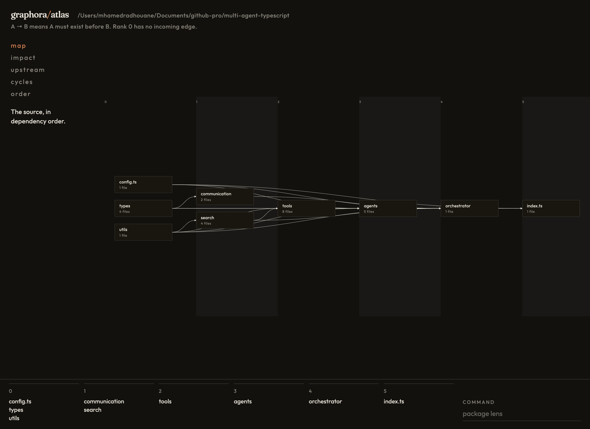
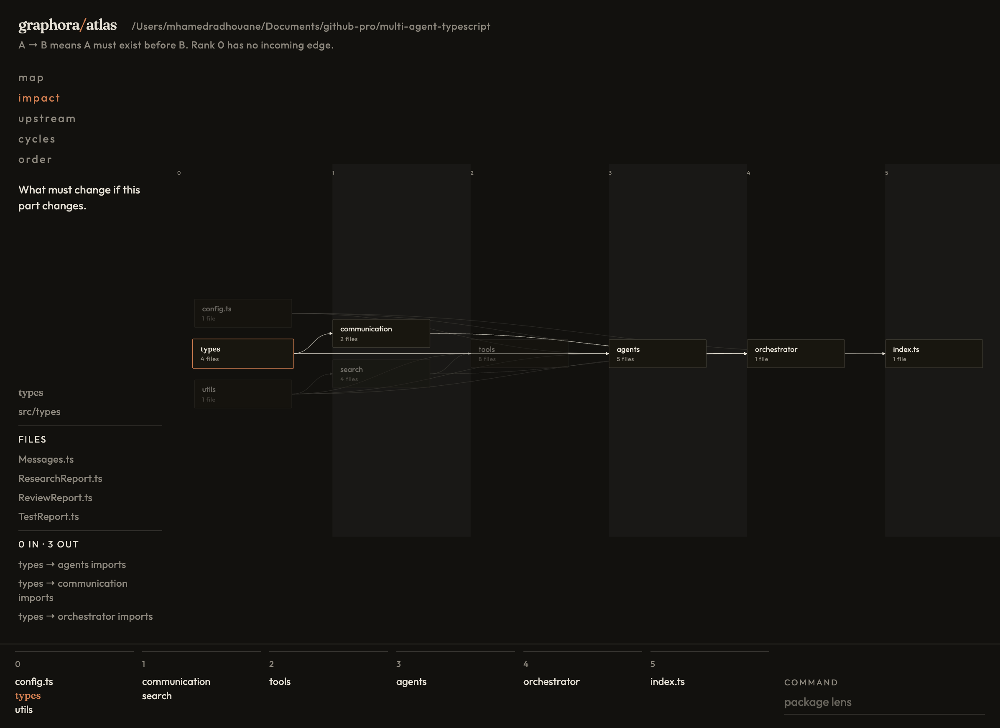
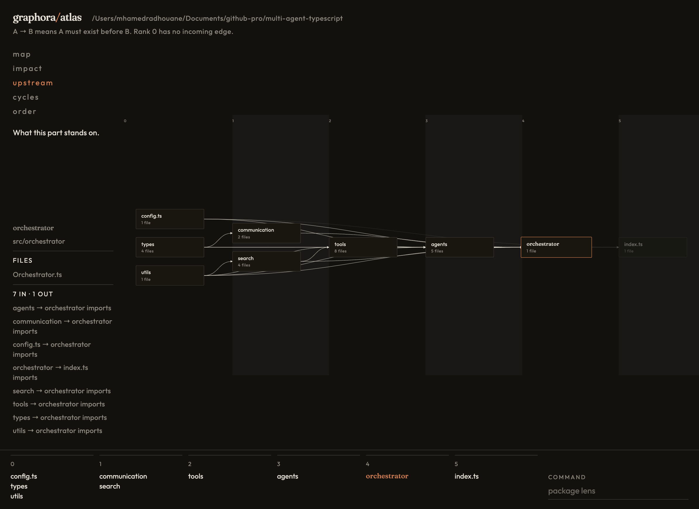
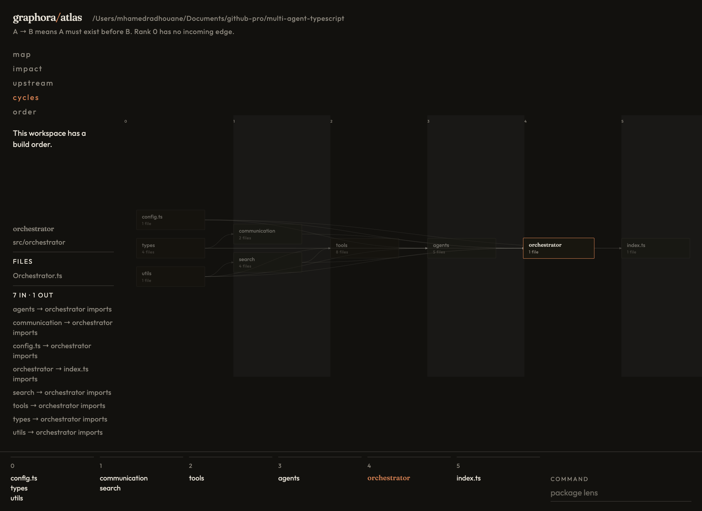
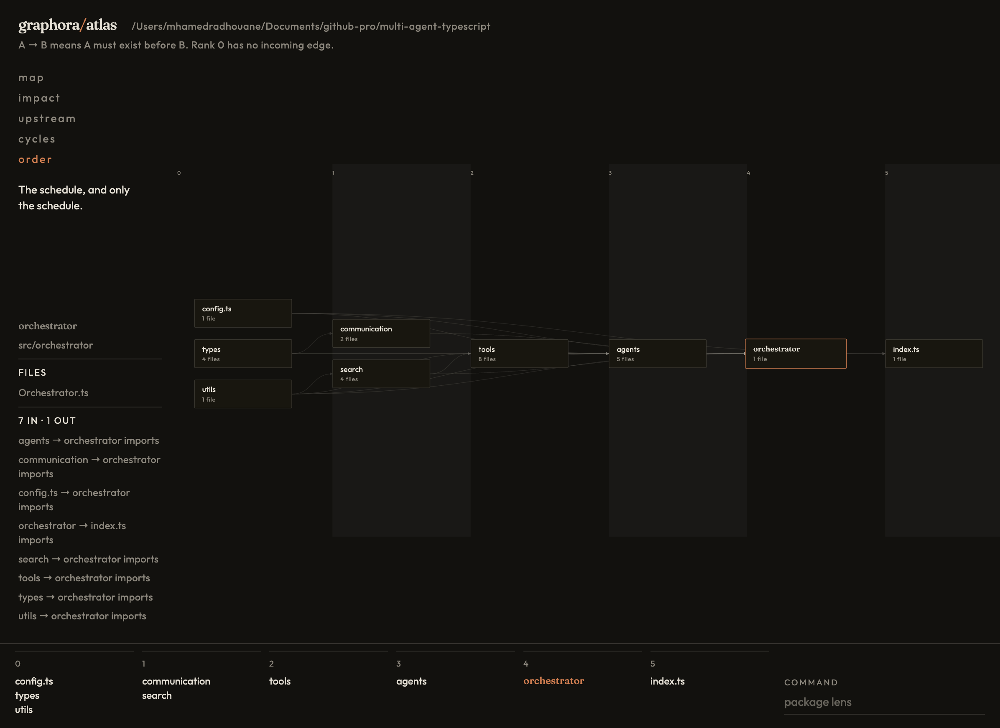
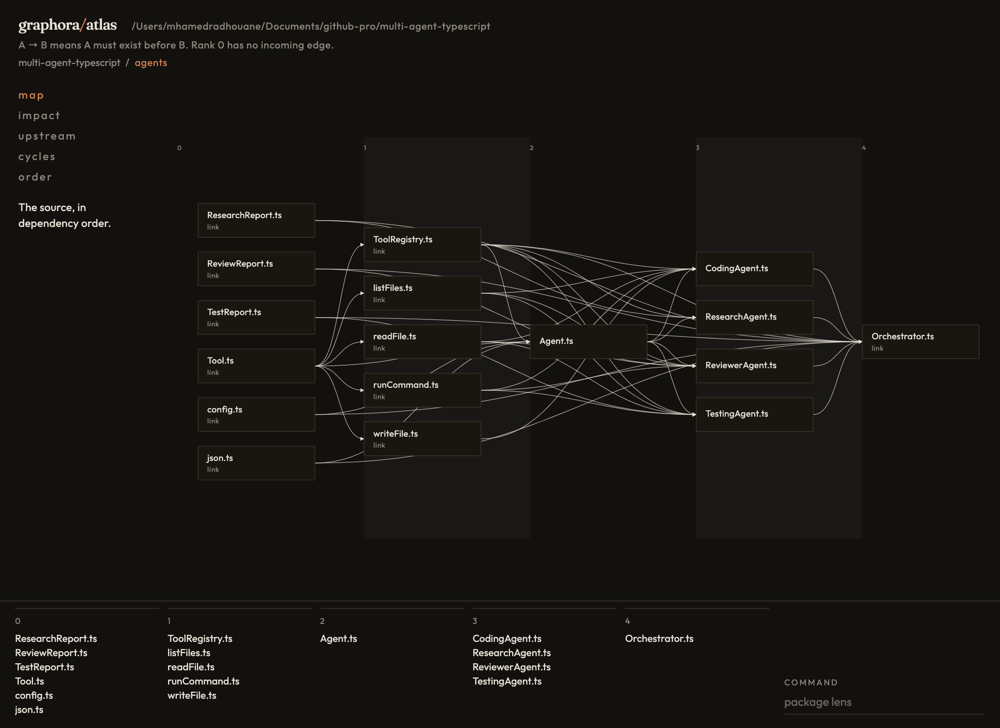

# graphora/atlas

graphora/atlas draws a project as a directed graph. The pictures in this guide are `multi-agent-typescript`, a single package, so atlas draws `src/`. Each folder under `src/` is a node. A file sitting beside those folders, such as `config.ts` or `index.ts`, is a node too.

An arrow runs from the thing that must exist first to the thing that depends on it. The line under the wordmark says the same thing: A → B means A must exist before B. Rank 0 has no incoming edge.

## Open it

From this repository:

```bash
npm run build
npm run dev -w graphora-atlas -- --root /Users/mhamedradhouane/Documents/github-pro/multi-agent-typescript
```

The first command builds graphora, which the map imports. The second scans that project, serves the map at `http://127.0.0.1:4318`, and opens a browser. Pass any other project the same way, with its absolute path after `--root`.

`npm run atlas` opens this repository. It does not forward `--root`. Refresh the page to rescan; the server reads the tree again on each load.

## Map



**Map** is the whole source, in dependency order. The sentence under the lenses says so: "The source, in dependency order."

Rank 0 is what nothing else has to precede: `config.ts`, `types`, and `utils`. The filmstrip along the bottom is that same schedule, one cell per rank:

| Rank | Parts                   |
| ---- | ----------------------- |
| 0    | config.ts, types, utils |
| 1    | communication, search   |
| 2    | tools                   |
| 3    | agents                  |
| 4    | orchestrator            |
| 5    | index.ts                |

`index.ts` is last because it imports the orchestrator. The orchestrator imports the agents, the tools, search, and the shared types.

Click a node to select it. The rail lists its path, its files, and every edge touching it. Hover the same node and a tooltip repeats that, with the files as bullets. Each edge is marked **stands on** (this part depends on that one) or **before** (this part must exist before that one). Click the empty field to clear the selection. Type a name while the command box is not focused and the other nodes dim in place.

## Impact



Select `types`, then **impact**. The sentence becomes "What must change if this part changes."

`types` is four files: `Messages.ts`, `ResearchReport.ts`, `ReviewReport.ts`, and `TestReport.ts`. A change there reaches everything downstream: `communication`, `agents`, `orchestrator`, and `index.ts`. Those stay lit. `config.ts`, `utils`, `search`, and `tools` dim, because they do not sit downstream of `types`.

The filmstrip uses the same selection. `types` is copper in rank 0, and the names it can reach stay readable in the later ranks.

## Upstream



Select `orchestrator`, then **upstream**. The sentence becomes "What this part stands on."

The orchestrator imports seven parts: `agents`, `communication`, `config.ts`, `search`, `tools`, `types`, and `utils`. Those stay lit. The rail lists the same edges as `agents → orchestrator imports`, and so on. `index.ts` imports the orchestrator, so it is downstream and stays dim.

## Cycles



**Cycles** asks where the order is impossible. This project has no loop, so the sentence changes to "This workspace has a build order." The ranks stay on the field, and the filmstrip still reads left to right.

When a project does contain a cycle, this lens keeps that loop in view. The parts inside it share a rank, because no schedule can place one of them strictly before the other.

## Order



**Order** is the schedule, and only the schedule. The sentence says that. The arrows fall back to a hairline, and you read the ranks: foundations in rank 0, then communication and search, tools, agents, the orchestrator, and `index.ts` last. The filmstrip is the same list.

## Go deeper



Right-click a folder and choose **Go deeper**. The map leaves the folder view and draws the files inside that part, plus the files one import away. The breadcrumb records the climb. Here it reads `multi-agent-typescript / agents`.

Inside `agents`:

- `Agent.ts` sits in the middle. `CodingAgent.ts`, `ResearchAgent.ts`, `ReviewerAgent.ts`, and `TestingAgent.ts` stand on it.
- Files outside the folder appear as neighbors, with the subtitle `link`: the report types, `Tool.ts`, `config.ts`, `json.ts`, the tool files, and `Orchestrator.ts`, which imports the agents.
- Rank 0 is what those files stand on. Rank 4 is `Orchestrator.ts`, outside the folder, waiting on the agents.

Click `multi-agent-typescript` in the breadcrumb to climb back to the folder map. Click an earlier crumb the same way when you have gone deeper more than once.

## Export

**Export** sits at the top right, beside the wordmark. It saves the picture on screen: the lens you have open, the selected node, and any name you have typed to dim the rest.

- **Draw.io** downloads a `.drawio` file. Open it in [diagrams.net](https://app.diagrams.net). The nodes stay editable, arrows still leave the right edge and enter the left, and a `bundle-includes` edge stays dashed.
- **PDF** and **JPEG** download that same picture.

The file name is the project and the lens. On this map it is `multi-agent-typescript-map.drawio`, `multi-agent-typescript-map.pdf`, or `multi-agent-typescript-map.jpeg`. Open **impact** with `types` selected and the file is `multi-agent-typescript-impact`, with `communication`, `agents`, `orchestrator`, and `index.ts` still lit.
