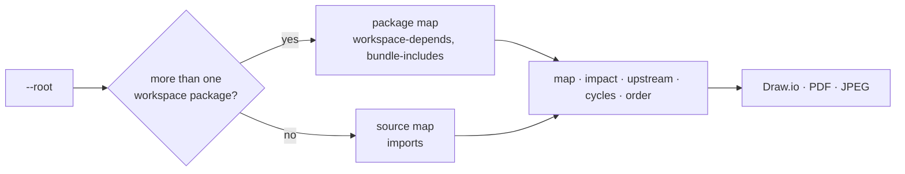

# graphora/atlas

**A reactive, animated map of software structure.**

graphora/atlas scans a project and draws it as a directed graph: which parts must exist before which others, what a change will reach, what a part stands on, where the order is impossible, and the schedule that falls out of it. It runs as a local web app and exports what you see to Draw.io, PDF, or JPEG.


The pictures in this guide are the `src/app` folder of an Angular front end (`rag-frontend`). Every screenshot comes from that project, except the loop under [Cycles](#cycles).

## Contents

- [Why Atlas](#why-atlas)
- [Features](#features)
- [Quick start](#quick-start)
- [How to read the map](#how-to-read-the-map)
- [Lenses](#lenses): [Map](#map), [Impact](#impact), [Upstream](#upstream), [Cycles](#cycles), [Order](#order)
- [Go deeper](#go-deeper)
- [Export](#export)
- [Controls](#controls)
- [CLI options](#cli-options)
- [What Atlas reads](#what-atlas-reads)
- [Library API](#library-api)
- [Development](#development)

## Why Atlas

A dependency list tells you what imports what. It does not tell you what order the parts come in, or what else moves when one of them changes. Atlas answers those questions directly:

| Question                                | Lens         |
| --------------------------------------- | ------------ |
| How is this project put together?       | **map**      |
| If I change this part, what else moves? | **impact**   |
| What does this part depend on?          | **upstream** |
| Is there an import loop?                | **cycles**   |
| In what order do the parts come?        | **order**    |

## Features

- **Two kinds of map.** A monorepo with several packages becomes a package graph. A single project becomes a map of its source tree: one node per top-level folder or loose file.
- **Dependency order at a glance.** Nodes sit in ranks. Rank 0 depends on nothing inside the project; each later rank stands on the ranks before it.
- **Five lenses** that answer one question each: map, impact, upstream, cycles, order.
- **Go deeper.** Right-click a folder to see the files inside it and the files one import away.
- **Inspect anything.** Hover a node for its files and edges; click it to pin those details in the rail.
- **Export** the current picture to Draw.io (editable), PDF, or JPEG.
- **Keyboard first.** A command box (`services impact`), type-to-filter, and arrow-key navigation along edges.
- **Library API.** The extractors and graph algorithms behind the UI are exported from `graphora-atlas`.

## Quick start

Atlas needs Node.js 20 or newer. From the project you want to map:

```bash
npx graphora-atlas
```

That scans the current directory, serves the map at `http://127.0.0.1:4318`, and opens your browser. Point it somewhere else with `--root`:

```bash
npx graphora-atlas --root ./src/app
```

To keep it in a project, install it as a dev dependency and add a script:

```bash
npm install --save-dev graphora-atlas
```

```json
{
  "scripts": {
    "atlas": "graphora-atlas --root ./src"
  }
}
```

Refresh the page to rescan. The server reads the tree again on every load.

### From a clone of Graphora

```bash
git clone https://github.com/MhamedR/Graphora.git
cd Graphora
npm ci
npm run build
npm run dev -w graphora-atlas -- --root /absolute/path/to/your-app/src/app
```

`npm run build` compiles graphora, which the map imports. Atlas stops with `Build graphora before starting atlas: npm run build` if you skip it. Pass the root as an absolute path here: npm runs the script from `packages/atlas`, so a relative `--root` resolves from there.

`npm run atlas` opens the Graphora repository itself, which is a workspace, so you get the package map. It does not forward `--root`.

## How to read the map

The line under the wordmark sets the one rule: **A → B means A must exist before B. Rank 0 has no incoming edge.**

An arrow runs from the thing that must exist first to the thing that depends on it. On a source map, an imported part points at the part that imports it. So `models → services` means `services` imports `models`.

Folders are drawn as folders and list their file count; loose files are drawn as pages. The strip along the bottom, the filmstrip, is the same schedule as a list, one column per rank.

For `rag-frontend/src/app`:

| Rank | Parts                                              |
| ---- | -------------------------------------------------- |
| 0    | models                                             |
| 1    | services                                           |
| 2    | app.component.ts, components, guards, interceptors |
| 3    | app.routes.ts                                      |
| 4    | app.config.ts                                      |

`models` imports nothing else in `src/app`, so it comes first. `app.config.ts` is last because it imports the routes and the interceptor.

## Lenses

The five lenses sit at the top of the left rail. Each one has a sentence under it that says what it answers.

### Map


**map** is the whole source, in dependency order: "The source, in dependency order."

Every node and edge is lit. Click a node to select it, and the rail lists its path, its files, and every edge touching it. Hover the same node and a tooltip repeats that, with its rank. Each edge is marked **stands on** (this part depends on that one) or **before** (this part must exist before that one).

Here `services` is selected. It holds six files, stands on `models`, and comes before `app.component.ts`, `components`, `guards`, and `interceptors`.

### Impact


Select a part, then **impact**: "What must change if this part changes."

With `services` selected, everything downstream stays lit: `app.component.ts`, `components`, `guards`, `interceptors`, `app.routes.ts`, and `app.config.ts`. `models` dims, because a change in `services` cannot reach it. The edges into the lit parts are the paths the change travels.

### Upstream


Select a part, then **upstream**: "What this part stands on."

`app.routes.ts` imports `components` and `guards` directly, and through them `services` and `models`. Those stay lit. `app.component.ts`, `interceptors`, and `app.config.ts` dim: `app.config.ts` imports the routes, so it is downstream, not upstream.

### Cycles


**cycles** asks where the order is impossible. `rag-frontend/src/app` has no import loop, so the sentence changes to "This workspace has a build order." and nothing needs attention. The ranks stay on the field.

When a project does contain a loop, this lens keeps it lit and dims everything else. The parts in the loop share a rank, because no schedule can place one strictly before the other:


This second picture is a four-file example made for this guide, since the Angular app has no loop to show. `auth/session.ts` imports `users/user.ts`, and `users/user.ts` imports `auth/token.ts`, so `auth` and `users` each stand on the other.

### Order


**order** is "The schedule, and only the schedule." The arrows fall back to a hairline and you read the ranks, left to right: `models`, then `services`, then `app.component.ts`, `components`, `guards`, and `interceptors`, then `app.routes.ts`, and `app.config.ts` last. The filmstrip is the same list.

## Go deeper


Right-click a folder and choose **Go deeper**. The map draws the files and subfolders inside that part, plus the files one import away. The breadcrumb records where you are; here it reads `app / components`.

Inside `components`:

- `chat`, `documents`, `login`, and `search` are the folders inside it.
- Files outside the folder appear as neighbours with the caption `link` and a dotted copper border: the services and models the components import, and `app.routes.ts`, which imports the components.
- The lenses work the same way at this depth.

Click `app` in the breadcrumb to climb back to the folder map. When you have gone deeper more than once, click any earlier crumb.

## Export


**export** sits at the top right. It saves the picture on screen: the lens you have open, the selected node, any name you have typed to dim the rest, and any node you have dragged. Choose a format from the menu and the browser downloads the file.

| Format      | What you get                                                                                                                                                                                                       |
| ----------- | ------------------------------------------------------------------------------------------------------------------------------------------------------------------------------------------------------------------ |
| **Draw.io** | A `.drawio` file for [diagrams.net](https://app.diagrams.net). Nodes stay editable, edges are labelled with their relation (`imports`), arrows leave the right edge and enter the left, and rank bands are locked. |
| **PDF**     | A one-page PDF of the picture.                                                                                                                                                                                     |
| **JPEG**    | The picture painted at twice its on-screen size.                                                                                                                                                                   |

The file name is the last folder of `--root` and the lens: `<project>-<lens>.<ext>`. With `--root …/src/app`, **impact** open, and `services` selected, the three files are `app-impact.drawio`, `app-impact.pdf`, and `app-impact.jpeg`. This is that JPEG, unedited:


Dimmed nodes keep their dimmed opacity in every format, so an exported impact or upstream picture reads the same way as the screen. The button is disabled while there is nothing to draw. If an export fails, the reason appears under the button.

Export is a browser feature of the map. The library API does not expose it.

## Controls

| Action                                   | Result                                                                                                  |
| ---------------------------------------- | ------------------------------------------------------------------------------------------------------- |
| Click a node, or a name in the filmstrip | Select it                                                                                               |
| Click the empty field                    | Clear the selection                                                                                     |
| Hover a node                             | Tooltip with rank, path, files, and edges                                                               |
| Drag a node                              | Move it; the arrows follow                                                                              |
| Right-click a folder                     | **Go deeper**                                                                                           |
| Type letters (command box not focused)   | Dim every node whose name and files do not match; Backspace deletes                                     |
| Arrow keys                               | Step the selection to a part it comes before; with nothing selected, select the first part in the order |
| Shift + arrow keys                       | Step the selection to a part it stands on                                                               |
| Escape                                   | Close an open menu, otherwise clear the filter and the selection                                        |
| Command box: `<part> <lens>`, then Enter | Select and switch lens in one go, for example `services impact` or `routes upstream`                    |

In the command box, either word can come first and both are optional. A part name can be partial as long as it matches only one node.

## CLI options

```bash
graphora-atlas [--root <path>] [--port <number>] [--no-open]
```

| Option            | Default                  | Description                                                                       |
| ----------------- | ------------------------ | --------------------------------------------------------------------------------- |
| `--root <path>`   | The current directory    | The project to scan. A relative path resolves from the current directory.         |
| `--port <number>` | `PORT`, otherwise `4318` | Port for the server. It listens on `127.0.0.1` only.                              |
| `--no-open`       | off                      | Do not open a browser. Also skipped when the `CI` environment variable is `true`. |
| `--help`, `-h`    |                          | Print the options and exit.                                                       |

The terminal prints the URL and the resolved root when the server starts.

From a clone, `npm run dev -w graphora-atlas -- <options>` takes the same options, but `--root` defaults to the Graphora repository and resolves from `packages/atlas`.

## What Atlas reads

Atlas picks the map for the root you give it:

1. **Workspace.** If the root's `package.json` declares workspaces with more than one package, each package is a node. `workspace-depends` edges come from package manifests. `bundle-includes` edges, drawn dashed, come from relative re-exports that copy another package's modules into a build. The lens sentences talk about packages and rebuilds.
2. **Source tree.** Otherwise Atlas reads `<root>/src` if it holds source files, and the root itself if it does not. That is why `--root …/rag-frontend/src/app` maps `app` directly.

On a source map:

- Source files are `.ts`, `.tsx`, `.js`, `.mjs`, `.cjs`, `.mts`, and `.cts`. `.d.ts` files, `node_modules`, `dist`, `coverage`, and dot-folders are skipped.
- Relative imports, re-exports, and dynamic `import('…')` calls become `imports` edges. Imports of packages such as `@angular/core` do not.
- Path aliases are followed when a `tsconfig.json` (or `jsconfig.json`) at the root defines `paths`.



## Library API

The package entry, `graphora-atlas`, exports the extractors and graph algorithms behind the map. The dev server and the UI stay behind their own entry points, so importing the library does not start a server or load the browser code. It is an ES module with TypeScript declarations.

```ts
import {
  buildPackageGraph,
  cycles,
  downstream,
  extractProject,
  order,
  upstream,
} from 'graphora-atlas';

const snapshot = await extractProject('/absolute/path/to/rag-frontend/src/app');
const graph = buildPackageGraph(snapshot);

order(graph);
// { kind: 'order', ids: ['models', 'services', 'app.component.ts', 'components',
//   'guards', 'interceptors', 'app.routes.ts', 'app.config.ts'] }

downstream(graph, 'services');
// ['app.component.ts', 'components', 'guards', 'interceptors', 'app.routes.ts', 'app.config.ts']

upstream(graph, 'app.routes.ts');
// ['components', 'guards', 'models', 'services']

cycles(graph);
// []
```

On a project with a loop, `order` returns `{kind: 'cycle', components}` with the strongly connected components instead of throwing, and `cycles` returns only the loops, for example `[['auth', 'users']]`.

| Export                                                      | Purpose                                                                                                 |
| ----------------------------------------------------------- | ------------------------------------------------------------------------------------------------------- |
| `extractProject(root)`                                      | Choose and run the right extractor. Returns an `AtlasSnapshot` with `kind` `'workspace'` or `'source'`. |
| `extractWorkspace(root)`, `extractSource(root)`             | Run one extractor directly.                                                                             |
| `extractSourceFocus(root, path)`                            | The **Go deeper** snapshot for one folder, or `null`.                                                   |
| `buildPackageGraph(snapshot)`                               | Build the directed graph the algorithms run on.                                                         |
| `order`, `downstream`, `upstream`, `cycles`, `components`   | The lenses as functions.                                                                                |
| `path(graph, from, to)`, `degrees(graph, id)`, `relationOf` | A path between two parts, in and out degree, and the relation on one edge.                              |
| `diffSnapshots(before, after)`                              | Added, removed, and changed nodes and edges between two snapshots.                                      |
| `layoutSnapshot(snapshot, viewport)`, `applyOffsets`        | Rank layout and dragged offsets, as used by the UI.                                                     |
| `createAtlasSession`, `connectAtlasSession`, `parseCommand` | The reactive session the UI renders, its React stores, and the command box parser.                      |

The model types (`AtlasSnapshot`, `PackageNode`, `AtlasEdge`, `Lens`, …) and constants (`LENSES`, `IMPORTS`, `WORKSPACE_DEPENDS`, `BUNDLE_INCLUDES`, …) are exported as well.

## Development

From the repository root:

```bash
npm run build                                               # graphora, which atlas imports
npm run build -w graphora-atlas                             # the published dist: library, CLI, prebuilt UI
node --import tsx --test packages/atlas/test/*.test.ts      # atlas tests
npx tsc --noEmit -p packages/atlas/tsconfig.json            # atlas type check
npm test                                                    # build, then every unit test
```

Source layout:

| Path                | Role                                              |
| ------------------- | ------------------------------------------------- |
| `src/server.ts`     | Server and CLI                                    |
| `src/extract-*.ts`  | Workspace and source extractors                   |
| `src/structural.ts` | Order, impact, upstream, and cycles on the graph  |
| `src/session.ts`    | Reactive session: selection, lens, filter, layout |
| `src/layout.ts`     | Rank layout                                       |
| `src/export.ts`     | Draw.io and PDF writers                           |
| `src/ui/`           | React UI, and the canvas painter for JPEG and PDF |

See [CONTRIBUTING.md](https://github.com/MhamedR/Graphora/blob/main/CONTRIBUTING.md) for the repository's checks and conventions.

## License

ISC. See [LICENSE](https://github.com/MhamedR/Graphora/blob/main/LICENSE).
